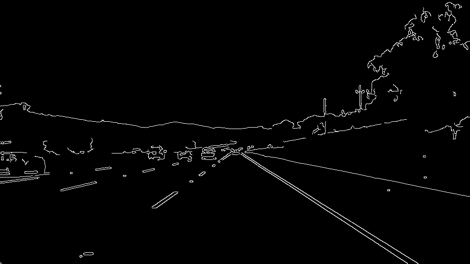

# **"Finding Lane Lines on the Road" Report**
---

[//]: # (Image References)

[image0]: ./test_images_out/s0.png "Grayscale"
[image1]: ./test_images_out/s1.png "Grayscale"
[image2]: ./test_images_out/s2.png "Grayscale"
[image3]: ./test_images_out/s3.png "Grayscale"
[image4]: ./test_images_out/s4.png "Grayscale"
[image5]: ./test_images_out/s5.png "Grayscale"

---

### Reflection

### 1. Describe your pipeline. As part of the description, explain how you modified the draw_lines() function.

My pipeline consisted of 5 steps. 

1. Converted the images to grayscale
2. Applied Gaussian smoothing for each image
3. Applied Canny
4. Applied image mask
5. Run Hough on edge detected image

In order to draw a single line on the left and right lanes, I modified the draw_lines() function by the following steps.

1. Extrapolate to the top and bottom of the lane.
2. Average the lines for the left line vs. the right line by their slope ((y2-y1)/(x2-x1))
   Moreover, I also adopted the ranges of the slopes from 15deg to 75deg to limit the error lines 

Follow images show results how the pipeline works.

Orginal image

Step1

Step2

Step3

Step4

Step5

Final Result

### 2. Identify potential shortcomings with your current pipeline

One potential shortcoming would be what would happen when ... 

Another shortcoming could be ...

### 3. Suggest possible improvements to your pipeline

A possible improvement would be to ...

Another potential improvement could be to ...
